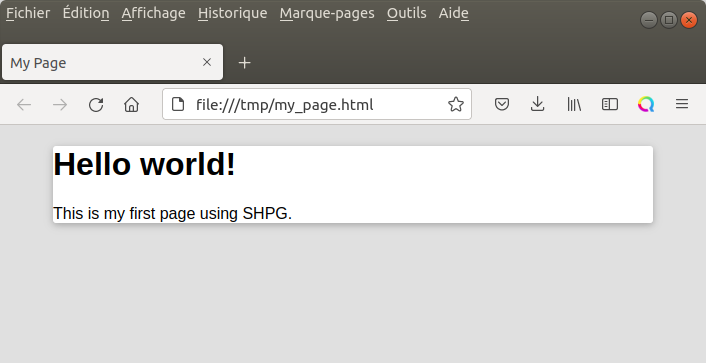

.. _shpg:

**************************
Static HTML Page Generator
**************************

SHPG is a python package dedicated to HTML page creation. Mainly for easy reporting purposes, 
it provides some simple tools to create basic HTML documents.

Getting started
-----------

Install
~~~~~~~
Download the package by cloning the git repository from GitHub and then run setup.py to install it.

.. code-block:: shell

   git clone https://github.com/BastienCagna/shpg.git
   cd shpg
   python setup.py install --user

Create your first page
~~~~~~~~~~~~~~~~~~~~~~
Let generate a very basic page with only a title and a paragraph:

.. code-block:: python

    import shpg

    # Create the page
    page = shpg.Page(title="My Page")
    page.content.append(shpg.Heading1("Hello world!"))
    page.content.append(shpg.Paragraph('This is my first page using SHPG.'))

    # Generate the HTML file
    report_path = "/tmp/my_page.html"
    page.save(report_path, portable=True)

Then open the /tmp/my_page.html file in a web broswer and you will see this:

How it works ?
--------------

What is HTML?
~~~~~~~~~~~~~
Write a python script that configure your pages by appending desired content. 

HTML use tag to setup neasted blocks of contnet. Basic HTML content is:
- Headings: 6 classes of title. Heading1 (oh H1) is the bigger one and Heading6 (or H6) is the smallest;
- Paragraphs: This is the main container for your text.
- Links:
- Images:

There is also some tags dedicated to structuring the content:
- Division:
- List:

Generating scripts from python
~~~~~~~~~~~~~~~~~~~~~~~~~~~~~~
The goal of this package is to generate multi-page HTML report or website. To do so, it use two main 
classes shpg.Page and shpg.Book to handle all the needed configuration (title, content, paths...).

